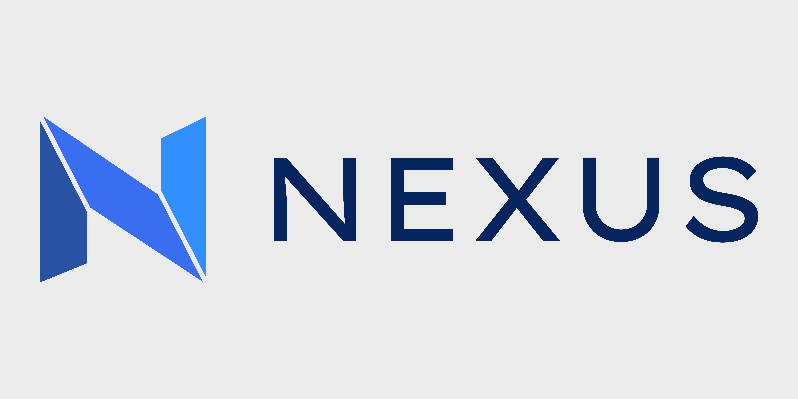
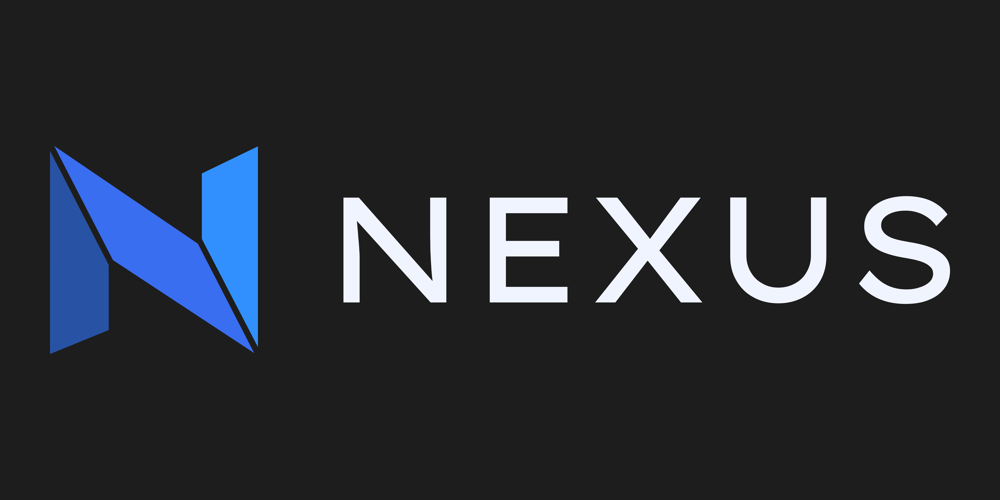

# Nexus — Brand Guidelines

## Identity

**Nexus** is a developer dashboard that brings together work items and pull requests from across platforms into a single, focused view. The brand should feel purposeful, technical, and calm — built for engineers who value clarity over noise.

## Logo & Wordmark

- **Wordmark font:** [Lexend Giga](https://fonts.google.com/specimen/Lexend+Giga)
- **Casing:** All-caps — `NEXUS`
- **Weight:** Regular (400)
- **Usage:** The wordmark text is always rendered in the Wordmark Navy color (`#06255F`) on light backgrounds, or white (`#F0F4FF`) on dark backgrounds. Never stretch, skew, or recolor the wordmark outside of the approved palette.

## Typography

| Role | Font | Weights |
|---|---|---|
| Wordmark | Lexend Giga | 400 |
| Headings | [Inter](https://fonts.google.com/specimen/Inter) | 600, 700 |
| Body | [Inter](https://fonts.google.com/specimen/Inter) | 400, 500 |
| Code / Monospace | [JetBrains Mono](https://fonts.google.com/specimen/JetBrains+Mono) | 400, 500 |

**Rationale:** Inter is a natural engineering-adjacent workhorse — highly legible at small sizes, widely available, and a familiar face in developer tooling. JetBrains Mono is purpose-built for code display and pairs well with the technical context of the app.

## Color Palette

### Brand Colors

| Name | Hex | Usage |
|---|---|---|
| **Primary** |  `#3A6EF0` | Primary actions, links, active states, wordmark |
| **Primary Dark** |  `#2853A4` | Primary hover/pressed states |
| **Primary Light** |  `#3290FE` | Subtle highlights, focus rings |
| **Wordmark Navy** |  `#06255F` | Wordmak text, other special use
| **Secondary** |  `#1ABFA3` | Secondary actions, badges, status indicators |
| **Secondary Dark** |  `#128F7A` | Secondary hover states |
| **Accent** |  `#F0883E` | Warnings, attention-grabbing callouts, CI/CD status |

**Rationale:**
- The **teal secondary** (`#1ABFA3`) complements the blue primary without competing — it reads as "confirmed / success" and pairs cleanly with the cool-leaning primary.
- The **amber accent** (`#F0883E`) provides high-visibility contrast for warnings and pipeline states, and adds warmth to an otherwise cool palette.

### Semantic Colors

| Name | Light | Dark |
|---|---|---|
| Success |  `#16A34A` |  `#4ADE80` |
| Warning |  `#D97706` |  `#FBB346` |
| Error |  `#DC2626` |  `#F87171` |
| Info |  `#3A6EF0` |  `#6B96F5` |

### Light Mode

| Token | Hex | Usage |
|---|---|---|
| `bg-base` |  `#F8F9FC` | App background |
| `bg-surface` |  `#FFFFFF` | Cards, panels, modals |
| `bg-subtle` |  `#EEF1F8` | Sidebar, section backgrounds |
| `bg-muted` |  `#E0E5F0` | Dividers, skeleton loaders |
| `text-primary` |  `#0F1623` | Headings, primary content |
| `text-secondary` |  `#4A5568` | Labels, metadata, secondary copy |
| `text-disabled` |  `#9AABBF` | Placeholder text, disabled states |
| `text-on-primary` |  `#FFFFFF` | Text on primary-colored elements |
| `border-default` |  `#D1D9E6` | Default borders |
| `border-strong` |  `#A0AEBE` | Emphasized borders |

### Dark Mode

| Token | Hex | Usage |
|---|---|---|
| `bg-base` |  `#0D1117` | App background |
| `bg-surface` |  `#161B27` | Cards, panels, modals |
| `bg-subtle` |  `#1C2333` | Sidebar, section backgrounds |
| `bg-muted` |  `#242D3E` | Dividers, skeleton loaders |
| `text-primary` |  `#E8EEFA` | Headings, primary content |
| `text-secondary` |  `#8B9EC4` | Labels, metadata, secondary copy |
| `text-disabled` |  `#4A5A78` | Placeholder text, disabled states |
| `text-on-primary` |  `#FFFFFF` | Text on primary-colored elements |
| `border-default` |  `#2A3550` | Default borders |
| `border-strong` |  `#3D4F6E` | Emphasized borders |

## Color Usage Principles

- **Primary blue** is reserved for actionable elements — buttons, links, active navigation states, and the wordmark. Avoid using it purely decoratively.
- **Secondary teal** is used for positive status signals: linked accounts, successful syncs, resolved items.
- **Accent amber** surfaces urgency without alarm — pipeline warnings, stale items, attention banners.
- **Backgrounds are intentionally low-contrast** between levels to keep the hierarchy subtle and reduce cognitive load during extended dashboard use.
- Ensure all text/background combinations meet **WCAG 2.1 AA** contrast minimums (4.5:1 for body text, 3:1 for large text and UI components).

## Voice & Tone

- **Direct.** No fluff. Developers read the smallest type first.
- **Calm.** The app exists to reduce chaos; the brand should feel like it already has things under control.
- **Precise.** Use exact language. Prefer "3 unassigned pull requests" over "some PRs need attention."
